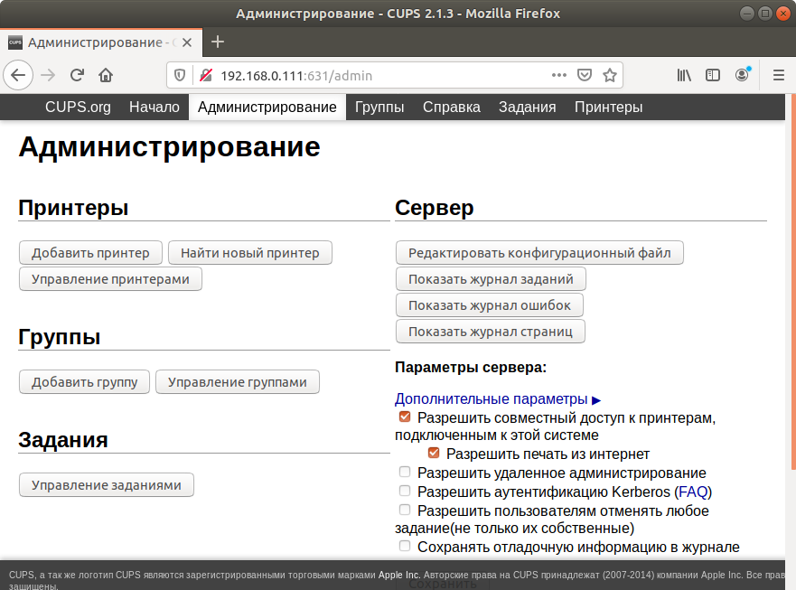
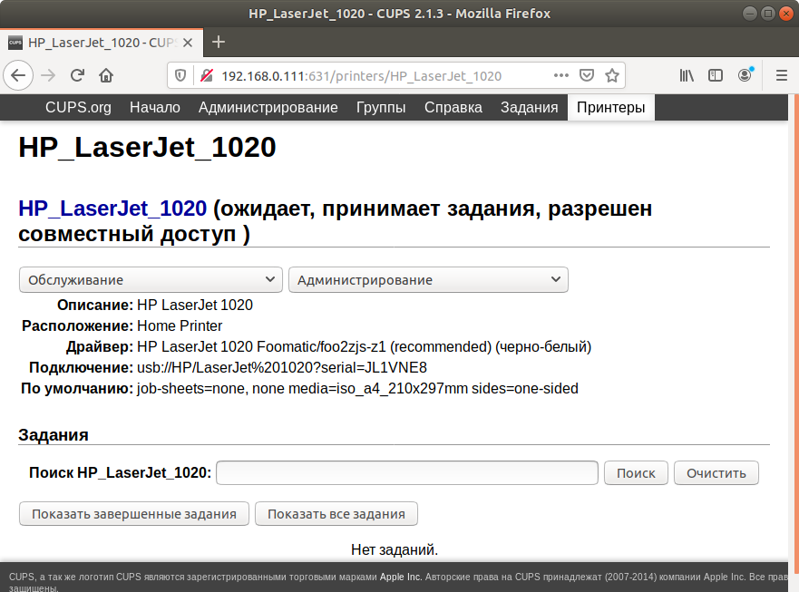

# Installing and configuring CUPS

1.	Install CUPS:
```sh
sudo apt-get install cups avahi-daemon avahi-discover
```

2.	Install Foomatic:
```sh
sudo apt-get install foomatic-db foomatic-db-engine
```

3.	Add user in group lpadmin:
```sh
sudo adduser USER lpadmin
```

4.	Configuring CUPS:
```sh
sudo vi /etc/cups/cupsd.conf
```
```sh
# Only listen for connections from local machine.
#Listen localhost:631 
Port 631
```
```sh
# Restrict access to the server...
&lt;Location /&gt;
  Order allow,deny
  Allow @Local /// add
&lt;/Location&gt;
# Restrict access to the admin pages...
&lt;Location /admin&gt;
  Order allow,deny
  Allow @Local /// add
&lt;/Location&gt;
# Restrict access to configuration files...
&lt;Location /admin/conf&gt;
  AuthType Default
  Require user @SYSTEM
  Order allow,deny
  Allow @Local /// add
&lt;/Location&gt;
```

5.	Restart CUPS:
```sh
sudo service cups restart
```

6.	Download and Install HP LaserJet 1020 [Driver](http://foo2zjs.rkkda.com/):
```sh
wget -O foo2zjs.tar.gz http://foo2zjs.rkkda.com/foo2zjs.tar.gz
tar zxf foo2zjs.tar.gz
cd foo2zjs
sudo make
sudo ./getweb 1020     # Get HP LaserJet 1020 firmware file
sudo make install
Configure hotplug (USB; HP LJ 1000/1005/1018/1020):
sudo make install-hotplug
If you use CUPS, restart the spooler:
sudo make cups
```

7.	Connect and configuring CUPS via Browser:
```sh
http://IP:631
```




