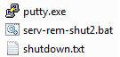

# Power off Orange Pi Zero before power off printer

1.	Linux:

```sh
ssh dima@192.168.0.111 'shutdown -h now'
```

2.	Windows:

To be placed in the same folder:



serv-rem-shut2.bat:
```sh
putty.exe -m shutdown.txt -ssh -P 22 -l dima -pw password 192.168.0.111
```

shutdown.txt:
```sh
shutdown -h now
```